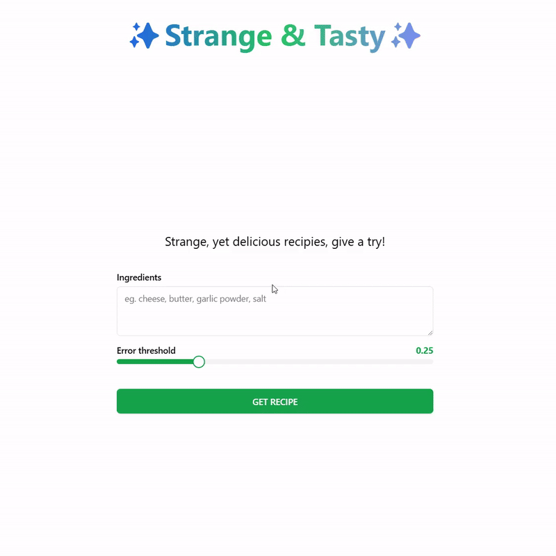

# Strange & Tasty

### Twórcy
- Władysław Kuczerenko
- Bartosz Hornung

### Opis projektu
<b>Strange & Tasty</b> to aplikacja umożliwiająca użytkownikowi znalezienie przepisu kulinarnego na podstawie podanej listy składników. System rozpoznaje przepisy, wykorzystując zaawansowane algorytmy przetwarzania języka naturalnego, takie jak <b>Sentence Transformers</b>, oraz technikę <b>najbliższych sąsiadów (Nearest Neighbors)</b>. Aplikacja pozwala znaleźć zarówno zwykłe przepisy, jak i te bardziej nietypowe, które są jednocześnie smaczne.

Dane wejściowe pochodzą z różnych źródeł, w tym:

- Dataset z kaggle - [RecipeNLG (cooking recipes dataset)
](https://www.kaggle.com/datasets/paultimothymooney/recipenlg/data)

- Generowanych automatycznie przepisów

- Przepisów napisanych ręcznie przez nas

### Funkcje projektu

- Wprowadzenie składników przez użytkownika.

- Analiza listy składników za pomocą Sentence Transformers.

- Znalezienie najlepiej pasujących przepisów z wykorzystaniem algorytmu najbliższych sąsiadów.

- Interakcyjna platforma internetowa, umożliwiająca intuicyjną obsługę.

### Stos technologiczny

1. Silnik systemu - Sentence Transformers z użyciem Nearest Neighbors do rozpoznawania przepisu na podstawie podanej listy składników przez uzytkownika
2. Backend - Fast API, czyli komunikacja między silnikiem a Frontend
3. Frontend - prosta aplikacja interakcyjna napisana we frameworku Nuxt 3.


### Instrukcja uruchamiania


#### Instalacja

1. Backend i silnik:
   ```
   - pip install pandas==2.2.2
   - pip install kagglehub==0.3.6
   - pip install sentence-transformers==3.3.1
   - pip install scikit-learn==1.5.0
   - pip install flask==3.1.0 
   - pip install flask-cors==5.0.0
   ```

2. Frontend (node >= 20, npm >= 10):
   ```
   - npm i
   - npm run dev
   ```


Uruchamianie aplikacji

Instrukcje uruchamiania backendu i frontendu oraz łączenia ich ze sobą.
1. Backend:
   - Uruchomić `server.py`
   - Po otrzymaniu informacji w konsoli `Models and data loaded successfully!` oznacza że serwer jest gotowy i czeka na składniki z frontend
2. Frontend:
   - Uruchomić `npm run dev`
   - Przejść na `localhost:3000`
3. Jeśli chcemy sprawdzić sam silnik:
   - Uruchomić `test.py`
   - Po otrzymaniu informacji w konsoli `Models and data loaded successfully!` czekamy na pole z napisem `ingredients: `
   - Wpisujemy składniki
   - Podajemy error-threshold (domyślnie jest ustawiony 0.3)
   - Dostajemy wynik, system pyta czy jesteśmy zadowoleni, jak nie to nic nie wpisujemy
   - Jeśli nie jesteśmy zadowoleni to system zapyta co miał zwrócić w takim przypadku
   - Podajemy `id_przepisu` bądź `None`
   - Powtarzamy ten proces
   - Algorytm zapisuje podane argumenty i otrzymane wyniki, jeśli chcemy je zapisać w pliku to przy kolejnym zapytaniu o składniki nic nie wpisujemy


### Jak działa system


- Użytkownik podaje listę dostępnych składników przez interfejs aplikacji.

- Backend przetwarza dane wejściowe i porównuje je z bazą przepisów, korzystając z Sentence Transformers i algorytmu Nearest Neighbors.

- Najlepiej dopasowany przepis jest przesłany do frontendu.

- Przepis jest prezentowany w przejrzysty i przyjazny sposób.

